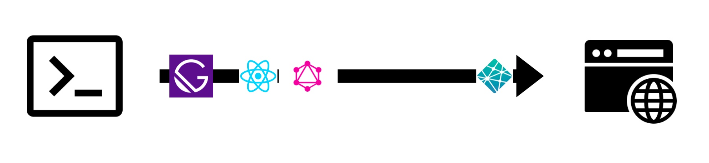
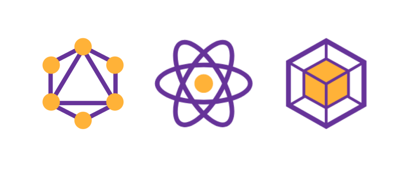

---

<h1 style="">What is GatsbyJs</h1>
<ul>
 <li>
 Gatsby is a shortcut to allow developers to quickly build excellent apps and sites.
 </li>
  <li>
    Gatsby is a React-based, GraphQL powered, static site generator
  </li>
  <li>
    It makes use of the latest and popular technologies including ReactJS, Webpack, GraphQL, modern ES6+ JavaScript and CSS
  </li>
<ul>

    

    GraphQL + React + Webpack = ❤

---

### Thank you